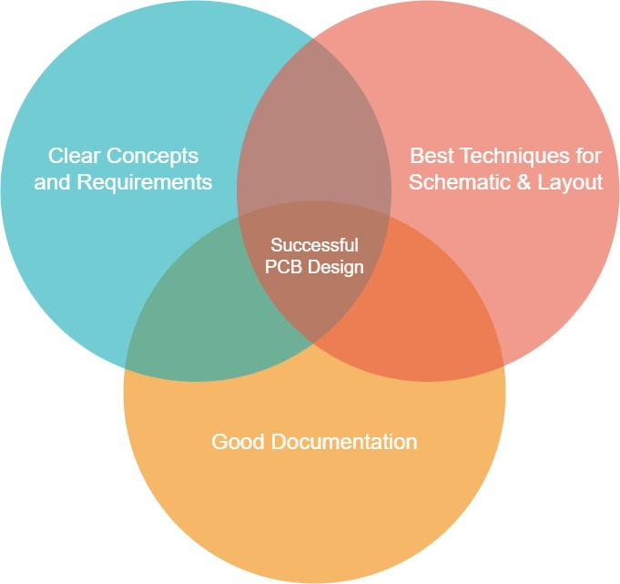

# PCB Design Guidelines

By the knowledge of those more experience then me and by the experience of many mistakes (or happy little accidents as Bob Ross would say) I've compiled a list of useful information to help anyone who works with PCB design.

 If this list has been useful in any way for you, I'm happy to be of service.
 
 ## Introduction

For any hardware project to as successful as it can be, it relays on three aspects:

- Clear definition of the requirements and objectives.
- Applying the best technics for schematic and layout together with good references and datasheets.
- Good documentation of the whole design process.

For the first aspect, one must first create a **list of the requirements** for that project, what is the bare minimum in terms of performance for that project to have.

Ask yourself: what kind of results do I want to achieve? What resources (tools, knowledge, materials) I have available? What references or proven concepts I have to use as a starting point?

Second aspect is to use the **best technics and practices** for the schematic and layout. This comes from **practice** and **experience**. 

But one thing that can help you improve is the use of good reference material. That could be other projects or simply reading the datasheet of component that you are using. Good datasheets usually have an application notes/guidelines for that specific component. Follow the datasheet and that will give you a good starting point.

The third aspect is the **art of documentation**. This is what defines and differentiate engineering from the backyard thinkering. Creating good documentation helps everyone in all aspects and moments of the project. The R&D team can create a solid information and overall product with those documents and the maintenance team can have the support needed for their job.

Just like Adam Savage wisely said: 
> "Remember Kids the Only Difference Between Screwing Around and Science Is Writing It Down" - Adam Savage, Mythbusters.

## PCB Design Flowchart
 
This flowchart represent the design process of mosts of the hardware projects. You can use this as a guide for your own projects.
 

 
## Guidelines and Good Practices
 
More info soon.
 
### Schematic
 
More info soon.
 
### Layout

More info soon.
 
### Documentation

More info soon.
 
<!-- Remember: **The main purpose of writing is to be read and understood by the reader, not to convince that you know more than the reader.** -->
 
## Tools and Resources

More info soon.
 
## Tips and Tricks

More info soon.
 
## References

More info soon.
