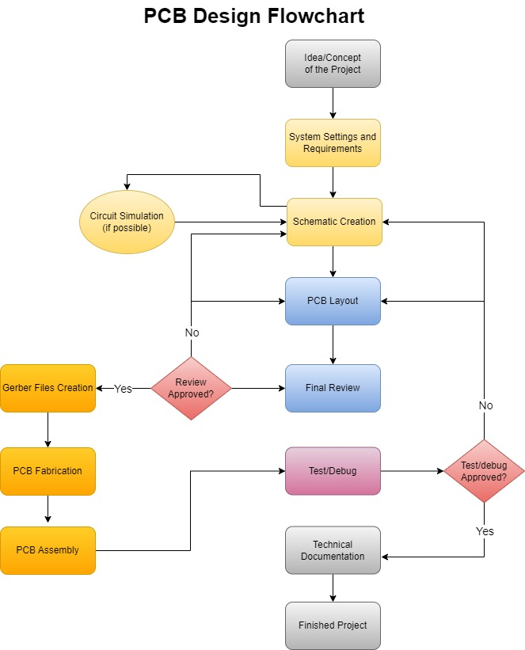

# PCB Design Guidelines

By the knowledge of those more experience then me and by the experience of many mistakes (or happy little accidents as Bob Ross would say) I've compiled a list of useful information to help anyone who works with PCB design.

 If this list has been useful in any way for you, I'm happy to be of service.
 
 PS: I use Altium designer, so some of this tips will be linked to Altium tutorials, but most of the guidelines can be use in any EDA of preference.
 
 ## Summary
 - [Introduction](https://github.com/GabrielVega-Eng/PCB-Design-Guidelines#introduction)
 - [PCB Design Flowchart](https://github.com/GabrielVega-Eng/PCB-Design-Guidelines#pcb-design-flowchart)
 - [Guidelines & Good Practices](https://github.com/GabrielVega-Eng/PCB-Design-Guidelines#guidelines--good-practices)
   - [Schematic](https://github.com/GabrielVega-Eng/PCB-Design-Guidelines#schematic)
   - [Layout](https://github.com/GabrielVega-Eng/PCB-Design-Guidelines#layout)
   - [Documentation](https://github.com/GabrielVega-Eng/PCB-Design-Guidelines#documentation)
 - [Tools & Resources](https://github.com/GabrielVega-Eng/PCB-Design-Guidelines#guidelines--good-practices)
 - [Tips & Tricks](https://github.com/GabrielVega-Eng/PCB-Design-Guidelines#tips--tricks)
 - [References](https://github.com/GabrielVega-Eng/PCB-Design-Guidelines#references)
 
 ## Introduction

For any hardware project to be as successful as it can be, it relays on three aspects:

- Clear definition of the concepts and requirements for that project.
- Applying the best technics for schematic and layout together with good references and datasheets.
- Good documentation of the whole design process.

For the first aspect, one must first create a **list of the requirements** for that project, what is the bare minimum in terms of performance for that project to have.

Ask yourself: what kind of results do I want to achieve? What resources (tools, knowledge, materials) I have available? What references or proven concepts I have to use as a starting point?

Second aspect is to use the **best technics and practices** for the schematic and layout. This comes from **practice** and **experience**. 

But one thing that can help you improve is the use of good reference material. That could be other projects or simply reading the datasheet of component that you are using. Good datasheets usually have an application notes/guidelines for that specific component. Follow the datasheet and that will give you a good starting point.

The third aspect is the **art of documentation**. This is what defines and differentiate engineering from the backyard thinkering. Creating good documentation helps everyone in all aspects and moments of the project. The R&D team can create a solid information and overall product with those documents and the maintenance team can have the support needed for their job.

Just like Adam Savage wisely said: 
> "Remember Kids the Only Difference Between Screwing Around and Science Is Writing It Down" - Adam Savage, Mythbusters.

## PCB Design Flowchart
 
This flowchart represent the design process of mosts of the hardware projects. You can use this as a guide for your own projects.
 

 
## Guidelines & Good Practices
 
There are some universal guidelines to use in any part of every hardware/PCB design:

 - Take the project step by step. Confirm and validate first before going to the next step.
 
 - If you see any mistakes or ajustments that are needed, **do it immediately**. Leaving it for some other time will only increase the chances of that mistake not being remembered and ultimately not being corrected;
 
 - Write down key decisions points that you took during the design. It will help you remember why some things where done the way it was when you are analysing results.
 
 
### Schematic
 
When creating a schematic always remember: **A good schematic makes you understand the circuit. A bad schematic makes you solve a puzzle and waste your time.**

 - When you create a schematic, first thing is to fill all the information about the project on the schematic sheet and parameters.
 
 - Create the circuit from **left to right**, **up to down**.
 
 - Use correct [symbols](https://www.electronics-tutorials.ws/resources/basic-schematic-symbols.html) and [abreviations](https://madpcb.com/terminology-of-electronic-components-in-pcb-assembly/) for components.
 
 - Use correct orientation for VCC and GND.
 
 - Use "+ XX V" for VCC. Example: +5V, +3V3, +12V.
 
 - [Net Labels](https://my.altium.com/altium-designer/getting-started/using-net-labels) are your best friends. Use them with clear and distinct names for each. It helps to keep a clean schematic. But most importantly it helps you identifying important details on the layout. [For example.](Images/Net_Label_Example.png)
 
 - Separate your circuits in blocks, identifying them for their functionality.
 
 - Place decoupling capacitor next to the IC that it needs. It helps identify which capacitor will go to which IC.
 
 - Place enough test points on your circuit for testing and debugging. Place at least one test point labeled "GND" for easy reference when testing.
 
 - Always check the pin sequence and footprint of your components with the datasheet. You never know who drew/created that component. If possible, create the component yourself to be sure. 
 
  - When creating a large project, use [multiple sheets](https://www.altium.com/documentation/altium-designer/multi-sheet-multi-channel-design) for each section/functionality. If a circuit block connects to another block in a different sheet, indicate which page/sheet that connection is going/coming.
  
  - Create a [cover page](https://www.youtube.com/watch?v=UStRZxAzZ2s) with all the useful information about the project.
  
  - Create [templates](https://www.altium.com/documentation/altium-designer/creating-schematic-templates) for your schematics.
 
 
### Layout

More info soon.
 
### Documentation

More info soon.
 
<!-- Remember: **The main purpose of writing is to be read and understood by the reader, not to convince that you know more than the reader.** -->
 
## Tools & Resources

More info soon.
 
## Tips & Tricks

More info soon.
<!-- If you are not sure of the functionality of a component, try to by a comercial module with that component and test the circuit. It will give you some basis for comparison. -->
 
## References

 - [Capturing Your Design Idea as a Schematic in Altium Designer](https://www.altium.com/documentation/altium-designer/capturing-your-design-idea-as-a-schematic-overview)
 - [Multi-sheet & Hierarchical Designs in Altium Designer](https://www.altium.com/documentation/altium-designer/multi-sheet-multi-channel-design)
 - [Creating Schematic Templates in Altium Designer](https://www.altium.com/documentation/altium-designer/creating-schematic-templates)
